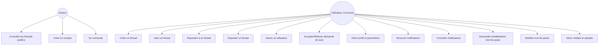
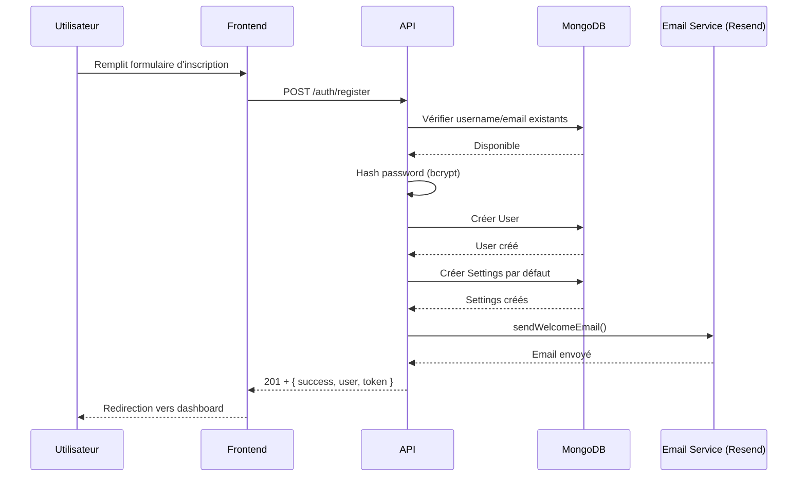
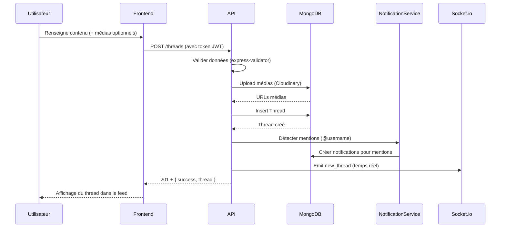
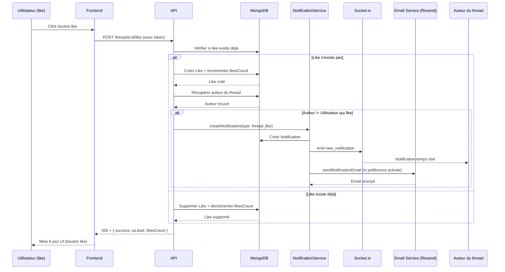
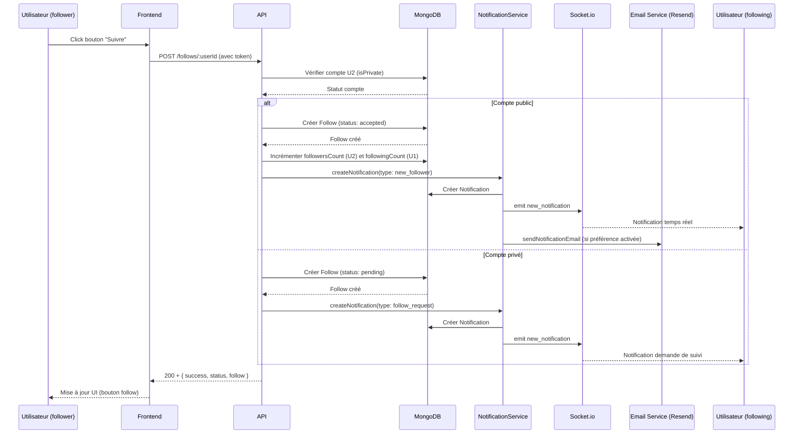
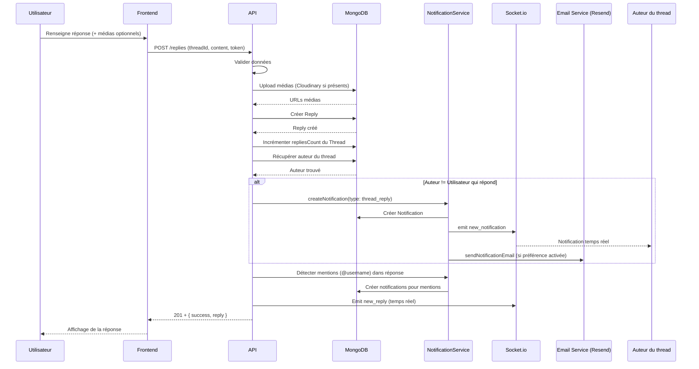
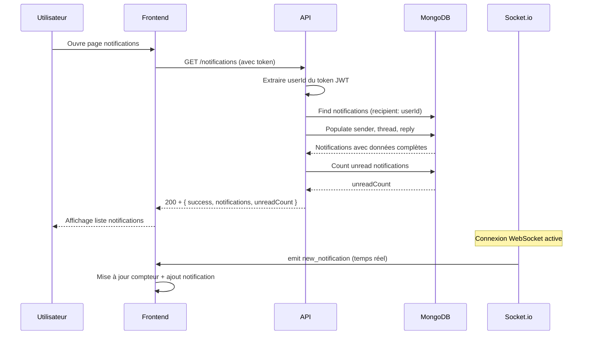
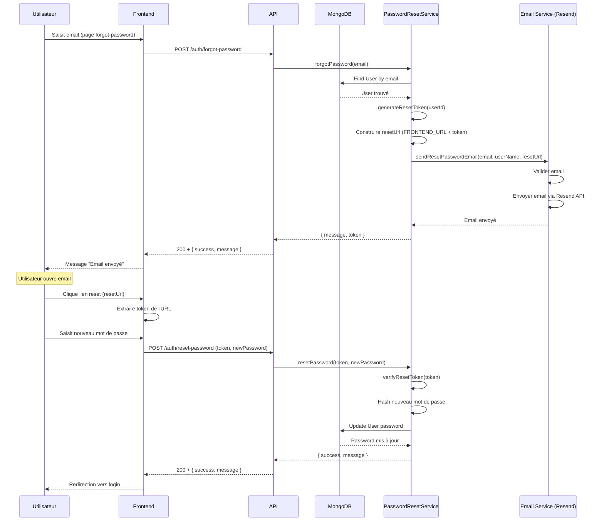
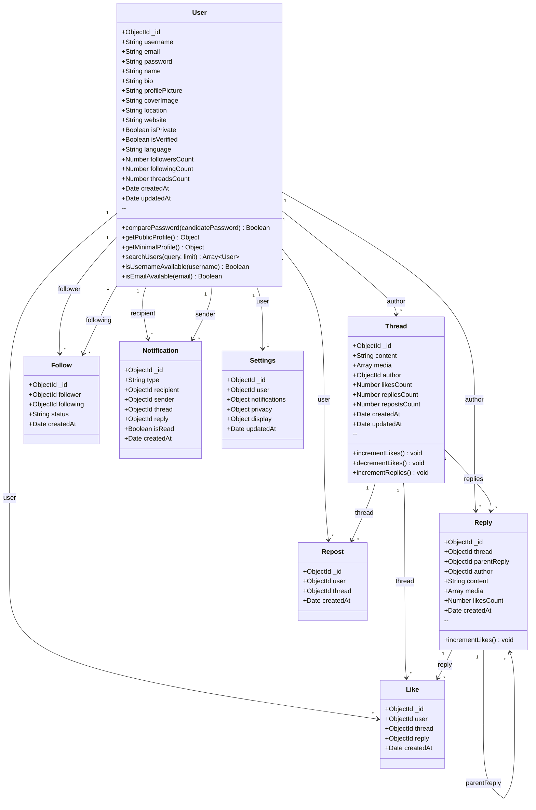
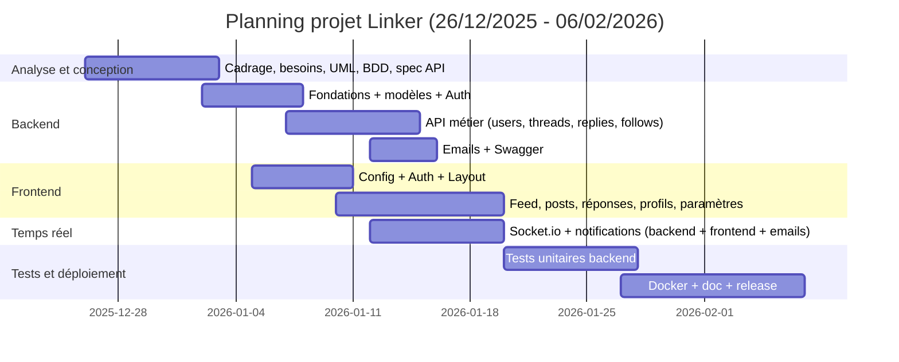

# Linker — Plateforme de reseau social web (Projet 2025)

## 1. Presentation generale
Linker est une application web de reseau social basee sur des discussions par threads. La plateforme permet de publier des contenus, d'interagir (likes, reponses, reposts), de gerer la visibilite des comptes (public/prive), et de recevoir des notifications en temps reel et par email.

Objectifs:
- Valider une architecture full stack moderne (SPA + API REST).
- Mettre en place des mecanismes de securite et de scalabilite.
- Produire une documentation technique complete (UML, Gantt, guide de deploiement).

## 2. Perimetre fonctionnel (cahier des charges)
- Authentification complete (inscription, connexion, sessions JWT)
- Comptes publics/prives avec gestion des demandes de suivi
- Profils utilisateurs (photo, bio, stats)
- Threads: creation, reponses, likes, reposts, statistiques
- Fil d'actualite dynamique
- Systemes follow/unfollow
- Notifications in-app, temps reel (Socket.io) et email
- Gestion des medias (uploads)
- Parametres (confidentialite, notifications, preferences)

## 3. Architecture technique
### 3.1 Frontend (SPA)
- React + Vite
- React Router, Context API
- Tailwind CSS / CSS custom
- Socket.io client

### 3.2 Backend (API REST)
- Node.js + Express
- Architecture en couches: routes / controllers / services / models
- MongoDB + Mongoose
- Swagger UI: `/api/docs`

### 3.3 Temps reel & Email
- Socket.io pour les notifications temps reel
- Resend API pour les emails (réinitialisation mot de passe, bienvenue, notifications)

## 4. Stack technique
**Frontend**
- React, Vite, React Router, Axios, Socket.io client
- Tailwind CSS

**Backend**
- Express, Mongoose, JWT, bcrypt
- Helmet, CORS, Rate limit
- Swagger (swagger-jsdoc, swagger-ui-express)
- Resend API, Nodemailer (fallback SMTP)

## 5. Structure du projet
```
ProjetFinal/
  backend/
  frontend/
  README.md
```

## 6. Installation & lancement
### Backend
```
cd backend
npm install
npm run dev
```

### Frontend
```
cd frontend
npm install
npm run dev
```

## 7. Variables d'environnement (exemple)
**Backend (.env)**
```
MONGO_URI=...
JWT_SECRET=...
FRONTEND_URL=http://localhost:5173
EMAIL_SERVICE=resend
EMAIL_PASSWORD=re_xxxxx  # Clé API Resend (commence par re_)
EMAIL_FROM=hello@linker.it.com
```

**Frontend (.env)**
```
VITE_API_URL=http://localhost:5000/api
```

## 8. Endpoints API (extraits)
Base URL: `/api`
- `/auth` (login, register, reset password)
- `/users` (profil, update, public profile)
- `/threads` (create, list, like, repost)
- `/replies` (create, list, like, delete)
- `/follows` (follow, requests, accept/reject)
- `/notifications` (list, read, delete)
- `/settings` (privacy, notifications, display)
- `/docs` (Swagger UI)

## 9. UML — Diagrammes

### 9.1 Diagramme de Cas d'Utilisation


### 9.2 Séquence d'Inscription d'un Utilisateur


### 9.3 Séquence de Création d'un Thread


### 9.4 Séquence de Like d'un Thread


### 9.5 Séquence de Follow d'un Utilisateur


### 9.6 Séquence de Réponse à un Thread


### 9.7 Séquence de Récupération des Notifications


### 9.8 Séquence de Réinitialisation de Mot de Passe


### 9.9 Diagramme de Classes (Complet)



## 10. Gantt (planification)

**Période :** 26/12/2025 → 06/02/2026. Diagramme détaillé avec tâches définies : voir **[GANTT.md](GANTT.md)**.



## 11. DevOps / Deploiement
- Dockerfiles disponibles pour frontend et backend
- CORS + Helmet + rate limiting actifs
- Deploiement possible sur Render (backend) + Vercel (frontend)

## 12. Tests
- Backend: Jest (unit tests)


---
**Auteur:** Projet full-stack 2025 — Linker