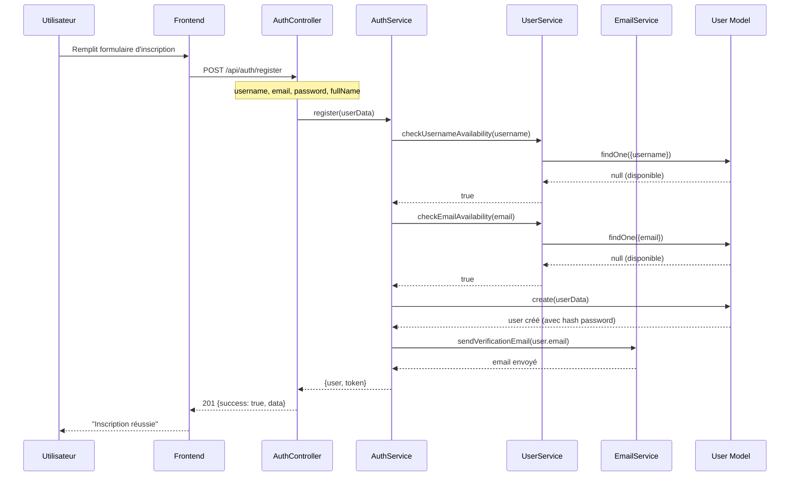
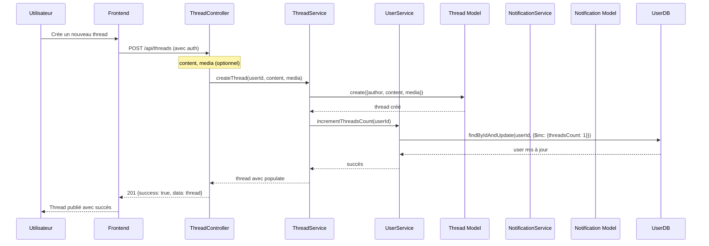
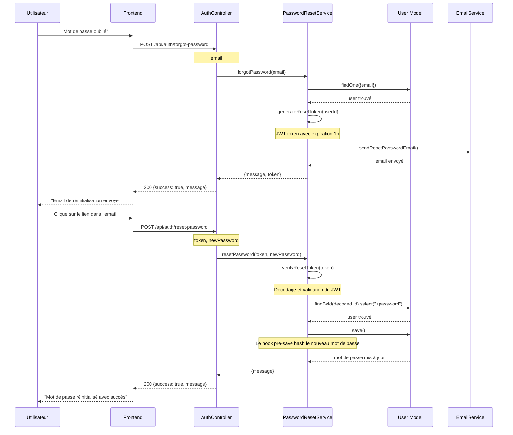

# Diagramme de Séquence - Projet Réseau Social

## 1. Séquence d'Inscription d'un Utilisateur



## 2. Séquence de Création d'un Thread



## 3. Séquence de Like d'un Thread

```mermaid
sequenceDiagram
    participant User as Utilisateur
    participant Frontend as Frontend
    participant ThreadController as ThreadController
    participant ThreadService as ThreadService
    participant ThreadDB as Thread Model
    participant LikeDB as Like Model
    participant NotificationService as NotificationService
    participant NotificationDB as Notification Model

    User->>Frontend: Clique sur "Like"
    Frontend->>ThreadController: POST /api/threads/:id/like
    ThreadController->>ThreadService: likeThread(threadId, userId)
    
    ThreadService->>ThreadDB: findById(threadId)
    ThreadDB-->>ThreadService: thread trouvé
    
    ThreadService->>LikeDB: findOne({user: userId, thread: threadId})
    LikeDB-->>ThreadService: null (pas encore liké)
    
    ThreadService->>LikeDB: create({user: userId, thread: threadId})
    LikeDB-->>ThreadService: like créé
    
    ThreadService->>ThreadDB: findByIdAndUpdate(threadId, {$inc: {likesCount: 1}})
    ThreadDB-->>ThreadService: thread mis à jour
    
    alt Auteur différent de l'utilisateur qui like
        ThreadService->>NotificationService: createNotification()
        NotificationService->>NotificationDB: create({
            type: "thread_like",
            recipient: thread.author,
            sender: userId,
            thread: threadId
        })
        NotificationDB-->>NotificationService: notification créée
    end
    
    ThreadService-->>ThreadController: {message, likesCount}
    ThreadController-->>Frontend: 200 {success: true, data}
    Frontend-->>User: "Thread liké" + compteur mis à jour
```

## 4. Séquence de Follow d'un Utilisateur

```mermaid
sequenceDiagram
    participant User as Utilisateur
    participant Frontend as Frontend
    participant FollowController as FollowController
    participant FollowService as FollowService
    participant UserDB as User Model
    participant FollowDB as Follow Model
    participant NotificationService as NotificationService
    participant NotificationDB as Notification Model

    User->>Frontend: Clique sur "Suivre"
    Frontend->>FollowController: POST /api/follows/:userId
    FollowController->>FollowService: followUser(followerId, followingId)
    
    FollowService->>FollowDB: findOne({follower: followerId, following: followingId})
    FollowDB-->>FollowService: null (pas encore follow)
    
    FollowService->>UserDB: findById(followingId)
    UserDB-->>FollowService: user trouvé
    
    alt Profil privé
        FollowService->>FollowDB: create({
            follower: followerId,
            following: followingId,
            status: "requested"
        })
        
        FollowService->>NotificationService: createNotification()
        NotificationService->>NotificationDB: create({
            type: "follow_request",
            recipient: followingId,
            sender: followerId
        })
        NotificationDB-->>NotificationService: notification créée
        FollowService-->>FollowController: "Demande envoyée"
    else Profil public
        FollowService->>FollowDB: create({
            follower: followerId,
            following: followingId,
            status: "accepted"
        })
        
        FollowService->>UserDB: updateMany(
            {$inc: {followersCount: 1}}, {_id: followingId}
        )
        FollowService->>UserDB: updateMany(
            {$inc: {followingCount: 1}}, {_id: followerId}
        )
        
        FollowService->>NotificationService: createNotification()
        NotificationService->>NotificationDB: create({
            type: "new_follower",
            recipient: followingId,
            sender: followerId
        })
        NotificationDB-->>NotificationService: notification créée
        FollowService-->>FollowController: "Abonnement réussi"
    end
    
    FollowController-->>Frontend: 200 {success: true, message}
    Frontend-->>User: Message de confirmation
```

## 5. Séquence de Réponse à un Thread

```mermaid
sequenceDiagram
    participant User as Utilisateur
    participant Frontend as Frontend
    participant ReplyController as ReplyController
    participant ReplyService as ReplyService
    participant ThreadDB as Thread Model
    participant ReplyDB as Reply Model
    participant NotificationService as NotificationService
    participant NotificationDB as Notification Model

    User->>Frontend: Répond à un thread
    Frontend->>ReplyController: POST /api/replies/:threadId
    Note over ReplyController: content
    
    ReplyController->>ReplyService: createReply(threadId, userId, content)
    
    ReplyService->>ThreadDB: findById(threadId)
    ThreadDB-->>ReplyService: thread trouvé
    
    ReplyService->>ReplyDB: create({
        author: userId,
        thread: threadId,
        content: content.trim()
    })
    ReplyDB-->>ReplyService: reply créée
    
    ReplyService->>ThreadDB: findByIdAndUpdate(
        threadId, {$inc: {repliesCount: 1}}
    )
    ThreadDB-->>ReplyService: thread mis à jour
    
    alt Auteur du thread différent de l'auteur de la réponse
        ReplyService->>NotificationService: createNotification()
        NotificationService->>NotificationDB: create({
            type: "thread_reply",
            recipient: thread.author,
            sender: userId,
            thread: threadId
        })
        NotificationDB-->>NotificationService: notification créée
    end
    
    ReplyService->>ReplyDB: findById(reply._id).populate("author")
    ReplyDB-->>ReplyService: reply avec author
    
    ReplyService-->>ReplyController: reply
    ReplyController-->>Frontend: 201 {success: true, data: reply}
    Frontend-->>User: "Réponse envoyée"
```

## 6. Séquence de Récupération des Notifications

```mermaid
sequenceDiagram
    participant User as Utilisateur
    participant Frontend as Frontend
    participant NotificationController as NotificationController
    participant NotificationDB as Notification Model
    participant UserDB as User Model

    User->>Frontend: Ouvre les notifications
    Frontend->>NotificationController: GET /api/notifications
    NotificationController->>NotificationDB: find({recipient: userId})
        .populate("sender", "username name profilePicture isVerified")
        .populate("thread", "content")
        .sort({createdAt: -1})
    
    NotificationDB-->>NotificationController: notifications
    
    NotificationController-->>Frontend: 200 {success: true, data: notifications}
    Frontend-->>User: Affiche la liste des notifications
    
    User->>Frontend: Marque comme lues
    Frontend->>NotificationController: PUT /api/notifications/read
    NotificationController->>NotificationDB: updateMany(
        {recipient: userId, isRead: false}, 
        {isRead: true}
    )
    NotificationDB-->>NotificationController: notifications mises à jour
    NotificationController-->>Frontend: 200 {success: true, message}
    Frontend-->>User: "Notifications marquées comme lues"
```

## 7. Séquence de Réinitialisation de Mot de Passe


